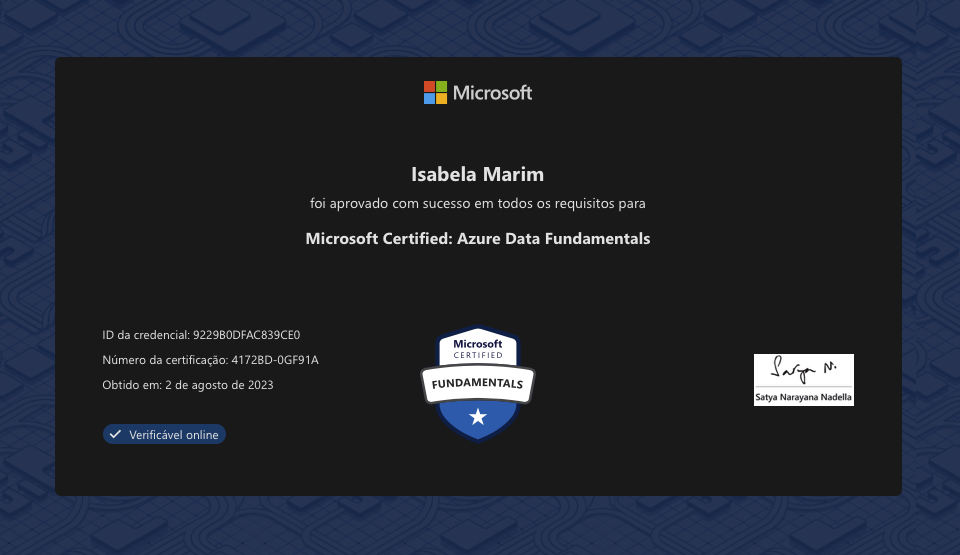

# **MyCV**

This repository contains the projects and certificates mentioned in my CV.
&nbsp;

## **Time line**
&nbsp;

### **2024**
&nbsp;

- EY Analytics - Data Integration - Bronze Learning: [Certificate](https://www.credly.com/badges/bc69f10e-2634-46fc-96bf-57f04e35145d/linked_in?t=scuwmi)
- EY Analytics - Data Visualization - Bronze Learning: [Certificate](https://www.credly.com/badges/bc69f10e-2634-46fc-96bf-57f04e35145d/linked_in?t=scuwmi)

&nbsp;
### **2023**
&nbsp;

- Microsoft Certified: Azure Data Fundamentals: [Certificate](https://www.efset.org/cert/kxkNgE)
  - Credential ID: 9229B0DFAC839CE0
  - Número da certificação: 4172BD-0GF91A

&nbsp;
### **2021**
&nbsp;

- English Certificate: [Certificate](https://www.efset.org/cert/kxkNgE)

&nbsp;
### **2020**
&nbsp;

- Scrum Certificate: [Course](https://onedrive.live.com/edit.aspx?resid=83EFDF5B145D00BA!9597&authkey=!AOl3ou0yj_Exevw)

&nbsp;
### **2019**
&nbsp;

- Data Scientist Certificate: [Course](https://onedrive.live.com/edit.aspx?resid=83EFDF5B145D00BA!9597&authkey=!AOl3ou0yj_Exevw)

&nbsp;
- RPG in Python: [Code](Projects/RPG.py)

- Electric Car: [Report](Projects/Project_Electric_Car.pdf) and [Code](Projects/electric_car.c)

- IoT Presentation: [Presentation](Projects/Presentation_IoT.pptx)

&nbsp;
### **2014**
&nbsp;

- Java and Minecraft Certificate: 
  

