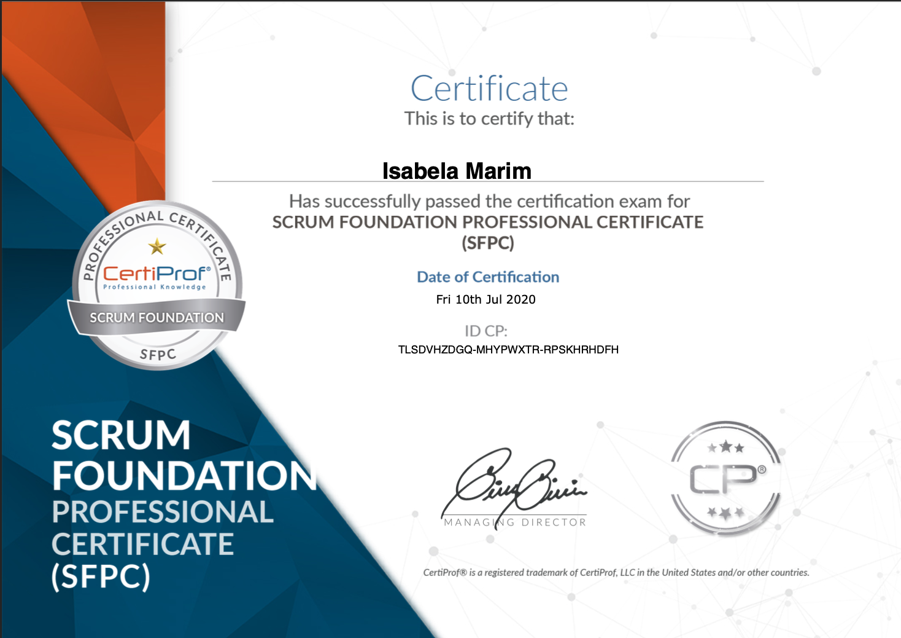
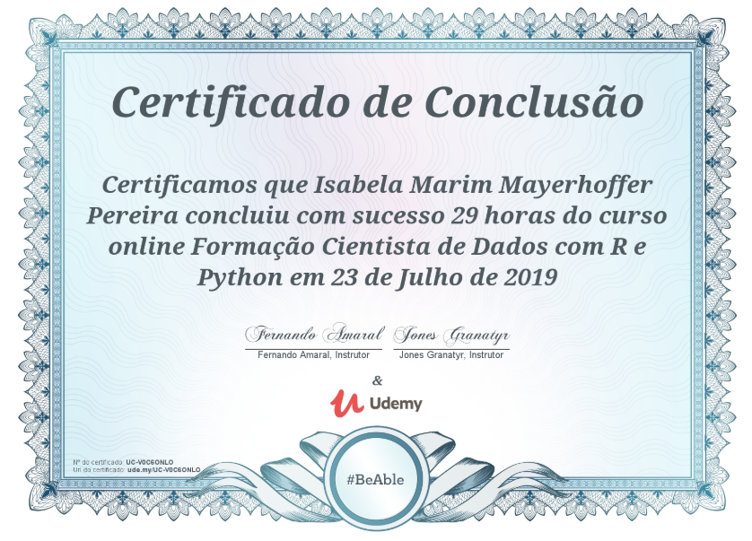

# **MyCV**

In these repository are the projects and certificates cited on my CV.  
&nbsp;

## **Time line**
&nbsp;

### **2021**
&nbsp;

- English Certificate: [Certificate](https://www.efset.org/cert/kxkNgE)

&nbsp;
### **2020**
&nbsp;

- Scrum Certificate: 

&nbsp;
### **2019**
&nbsp;

- Data Scientist Certificate: 

&nbsp;
- RPG in Python: [Code](Projects/RPG.py)

- Electric Car: [Report](Projects/Project_Electric_Car.pdf) and [Code](Projects/electric_car.c)

- IoT Presentation: [Presentation](Projects/Presentation_IoT.pptx)

&nbsp;
### **2014**
&nbsp;

- Java and Minecraft Certificate: 
  

